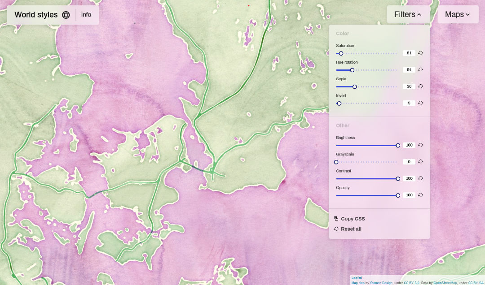

# World Styles

World Styles is a GUI editor for Leaflet maps using CSS filters. You can edit the sample maps or import your own Tile data through an URL. 
https://leafletjs.com/

Sample maps are from openstreetmap, opentopomap and Stamen Design. Use appropriate attribution in your project. 

This project was bootstrapped with [Create React App](https://github.com/facebook/create-react-app).

## Available Scripts

In the project directory, you can run:

### `npm start`

Runs the app in the development mode.\
Open [http://localhost:3000](http://localhost:3000) to view it in your browser.

### `npm run build`

Builds the app for production to the `build` folder.\
It correctly bundles React in production mode and optimizes the build for the best performance.

## Learn More

Richard Lundquist is a digital designer and artist based in Copenhagen, Denmark. 
Check out more of my projects: https://richardlundquist.xyz/
